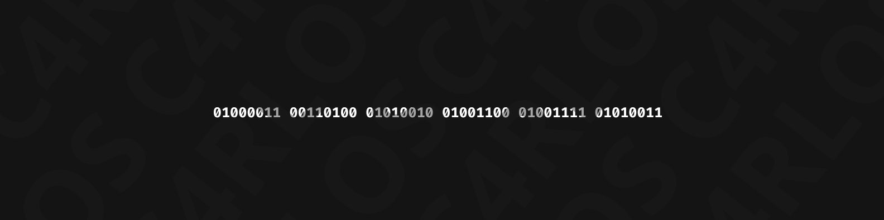

# Olá, eu sou José Carlos! 👋

Sou um entusiasta da tecnologia e Programador Back-End, graduando em **Análise e Desenvolvimento de Sistemas**. Tenho mais de 4 anos de experiência na organização Amigos do Bem, onde atuo no desenvolvimento e manutenção de APIs e aplicações web.

💻 Codando com **Laravel, PHP e Python**.

🔵 Fazendo um simples "Hello, World" e meu Windows deu tela azul (por isso adotei o **Linux Ubuntu** como meu ambiente principal de desenvolvimento! 🐧).

### 🛠️ Tecnologias e Ferramentas

* **Linguagens & Frameworks:** PHP, Laravel, Python
* **Banco de Dados & Cache:** MySQL, Redis

### 💼 Experiência em Destaque

* **Amigos do Bem (Fev 2021 - Presente):** Iniciei prestando suporte de TI e auxiliando no laboratório. Hoje, atuo como Programador Back-End, desenvolvendo e integrando serviços, otimizando consultas de banco de dados e garantindo a performance dos sistemas da instituição.

### 🎓 Educação e Certificações

**Formação Acadêmica:**
* **Graduação em Análise e Desenvolvimento de Sistemas** | *UNOPAR* (Jan 2025 – Jun 2027)
  * Foco em programação, banco de dados, engenharia de software e desenvolvimento de aplicações web.
* **Técnico em Informática (Ensino Médio Integrado)** | *EEEP Padre João Bosco de Lima* (Jan 2018 – Dez 2020)
  * Formação com foco em programação web e suporte técnico.

**Certificações:**
* 🏆 **Programador Web** | *Senac Ceará* (Mai 2024) - [Exibir credencial](https://drive.google.com/file/d/141W2X-8vBr_bo-FDSoE18L9-Ddyvk-cj/view)
* 🏆 **Capacitação em Webdesign (CMS)** | *Amigos do Bem* (Mar 2024) - [Exibir credencial](https://drive.google.com/file/d/14fpNNo2bMD90LuEHbwgdZzIgGYe63Esz/view?usp=sharing)
* 🏆 **Alura -  Full Certificate** | *Alura* - [Exibir credencial](https://cursos.alura.com.br/user/carlosolliveira/fullCertificate/7715e53de2d5549d2a82f2c2451407bb)
